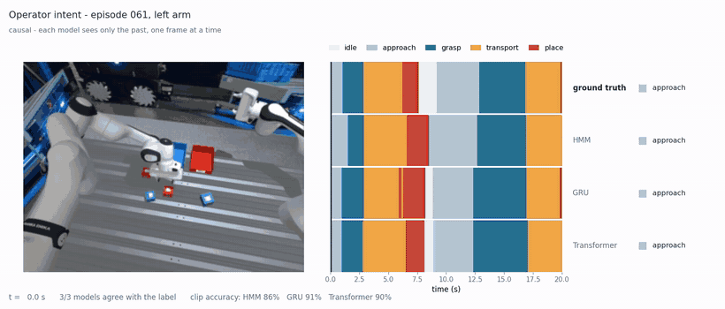
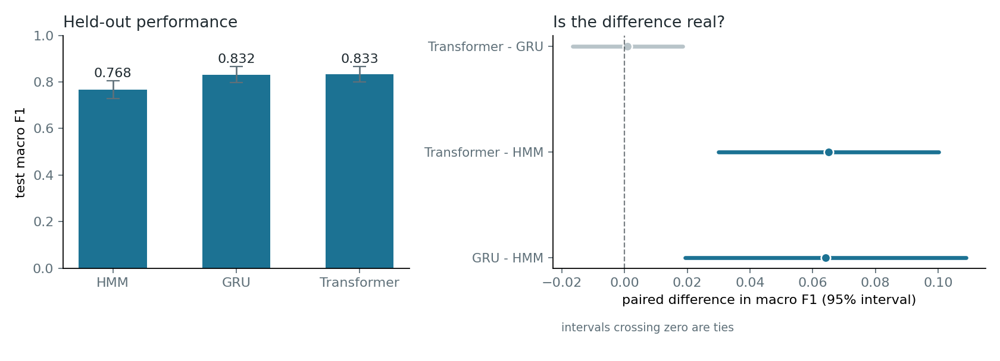
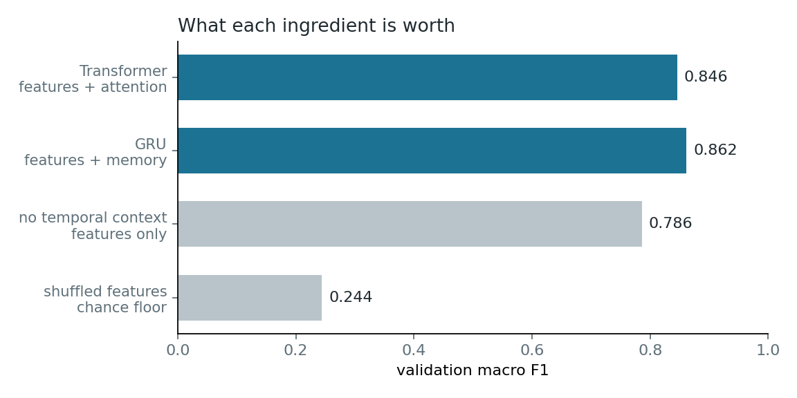
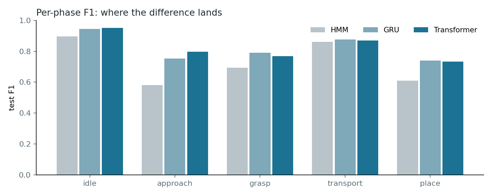
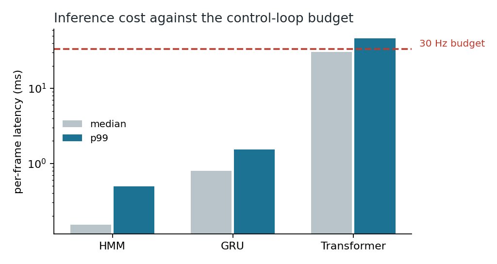

# teleop-intent

Predicting what a teleoperator is trying to do, one frame at a time, from arm
state and eye tracking.

Part of a bimanual teleoperation system: two Franka Panda arms operated over VR
with realistic network latency. This module infers the operator's **phase**
(idle / approach / grasp / transport / place) and their **target** (which object
or bin they are acting toward) causally, so downstream components can react
while the action is still happening rather than after it.

Three model families are implemented behind one interface and compared under
identical conditions: a structured HMM, a GRU, and a causal transformer.



*Held-out episode 061, left arm. Head camera on the left; ground truth and each
model's belief as segmentation ribbons on the right. Every model is stepped
frame by frame in order — no lookahead, no smoothing. Full-resolution MP4:
[docs/intent_comparison.mp4](docs/intent_comparison.mp4).*

---

## Results

Held-out test split, 11 episodes / 22 (episode, arm) pairs, never used for
fitting or selection.

| model | parameters | test macro F1 | 95% interval vs HMM |
|---|---|---|---|
| HMM (+ duration model) | — | 0.768 | — |
| GRU | 28.5k | **0.832** | +0.064 [+0.019, +0.109] |
| Transformer | 28.8k | **0.833** | +0.065 [+0.030, +0.100] |

**GRU vs Transformer: +0.001, interval [−0.017, +0.018] — a tie.**

Macro F1 rather than accuracy: idle is over half of all frames, and a model that
has learned nothing still reaches 60% frame accuracy on this task.



### What each ingredient is worth

Every claim has a control. Each row differs from the one above it by exactly one
thing.

| | validation macro F1 | contribution |
|---|---|---|
| shuffled features (chance floor) | 0.244 | — |
| features, no temporal context | 0.786 | **+0.54** |
| + memory (GRU) | 0.862 | **+0.076** |
| + attention (Transformer) | 0.846 | **+0.00** |
| 3.6x capacity (103k transformer) | 0.819 | **−0.03** |



Three unrelated mechanisms — a Bayesian filter, a recurrent state restarted every
frame, and attention restricted to a single frame — land within 0.011 of each
other at ~0.78. That number is a property of the data, not of any model.

### Where the gains land



The learned models do not improve uniformly over the structured baseline, which
is what the aggregate macro F1 hides.

### The null result was predicted, not discovered

Before the transformer was written, segment-duration statistics put phase lengths
at 57–137 frames ([docs/figures/durations/](docs/figures/durations)) and a
boundary analysis showed the residual errors were segment *extent* rather than
missed segments. Both say the task is short-horizon. The transformer was then
given a 1023-frame (~34 s) receptive field — roughly two full pick-place cycles,
deliberately more reach than the measured dependency length — and gained nothing.
Increasing capacity 3.6x made it worse.

### Deployment cost is not symmetric

The module runs inside a 30 Hz control loop, so it has 33 ms per frame and a late
frame is simply late — there is no averaging away a miss.



The HMM and the GRU cost well under a millisecond per frame, and their per-frame
work is constant by construction. The transformer re-encodes its whole context
buffer every frame, averages 31 ms, and misses the budget on roughly one frame in
five. **The GRU is the deployable choice, and it is not the model that scored
highest on validation.**

Prediction entropy separates correct from incorrect predictions by ~3x, which
makes it usable as a confidence gate rather than only as a diagnostic.

Full numbers: [docs/results.md](docs/results.md).

---

## Running it

Requires Python 3.10+, `numpy`, `h5py`, `matplotlib`. The HMM needs nothing
else; the GRU and transformer need PyTorch.

```bash
# train
python -m models.hmm.train         --store-root /path/to/episodes --out checkpoints/hmm/v1.npz
python -m models.gru.train         --store-root /path/to/episodes --out checkpoints/gru/v1.pt
python -m models.transformer.train --store-root /path/to/episodes --out checkpoints/transformer/v1.pt

# score any model on the held-out split
python eval/score.py --store-root /path/to/episodes --split test \
    --model models.gru.model.GRUIntentModel --checkpoint checkpoints/gru/v1.pt \
    --out-dir eval/reports/gru_v1

# compare scored models with paired statistics
python eval/compare_models.py eval/reports/hmm_v1 eval/reports/gru_v1 --labels HMM GRU

# per-frame latency against the 30 Hz budget
python eval/benchmark_latency.py --store-root /path/to/episodes \
    HMM=models.hmm.model.HMMIntentModel:checkpoints/hmm/v1.npz

# regenerate every figure and the results table into docs/ (needs only the reports)
python eval/make_figures.py

# render the side-by-side comparison video
python viz/compare_video.py --store-root /path/to/episodes --episode 061 --side left \
    --start 300 --frames 600 \
    HMM=models.hmm.model.HMMIntentModel:checkpoints/hmm/v1.npz \
    GRU=models.gru.model.GRUIntentModel:checkpoints/gru/v1.pt
```

Controls, which should accompany any reported number:

```bash
python -m models.gru.train         ... --shuffled-control   # chance floor
python -m models.gru.train         ... --memoryless         # features only
python -m models.transformer.train ... --window 1           # features only
```

Tests run without the dataset, without PyTorch, and without the simulator:

```bash
python tests/test_hmm_fixes.py
python tests/test_gru.py
python tests/test_transformer.py
```

They cover the properties that fail silently: strict causality, that the
training-time forward equals the frame-by-frame path used at deployment, that
excluded candidates receive exactly zero probability, and that a model computes
the same function in training and evaluation mode. Several findings above exist
only because one of these refused to pass.

---

## Layout

```
models/base.py            IntentModel interface: reset() / step(frame) -> IntentOutput
models/hmm/               structured baseline: phase HMM + sticky target filter
models/gru/               recurrent model; features/ is shared by all learned models
models/transformer/       causal windowed attention (ALiBi)
eval/                     scoring, model comparison, figures, diagnostics
docs/                     the figures, tables and video the README cites
labeling/                 hand-labelling tool
viz/playback.py           episode playback with live intent overlay (Rerun)
viz/compare_video.py      side-by-side model comparison video
tests/                    runnable with no data and no GPU
```

All three models implement the same interface and consume identical features, so
any score difference is attributable to the model rather than to its inputs.

---

## Data

~120 teleoperated episodes of a bimanual colour-sorting task, hand-labelled per
frame per arm. Splits are version-controlled in `data/splits/`, so the
experimental design is reproducible even though the episodes themselves are not
distributed here (tens of GB of HDF5 with video). Available on request.

Per-episode scores and training curves in `eval/reports/` and
`checkpoints/*_history.csv` are the inputs to `eval/make_figures.py`, so **every
number and figure above can be regenerated without touching the dataset.**

---

## Limitations

- 58 training episodes. Intervals are wide and honestly so; differences under
  ~0.02 macro F1 are not measurable on this validation set.
- Around 5% of committed target labels name a candidate the model's own pool
  excludes, mostly during transport. That is an unresolved question about what
  "target" means while carrying an object, and those frames are unwinnable for
  every model here.
- Evaluated on replayed episodes. Closed-loop behaviour under real timing is not
  yet measured.

## Next

The residual errors for both learned models are segment *extent* — boundaries
placed late, 1.4–1.8x more predicted segments than true ones — which is the one
failure the HMM's explicit duration model addresses directly. A learned emission
inside that duration-structured decoder combines two already-tested components
and targets the error neither learned model touched.
